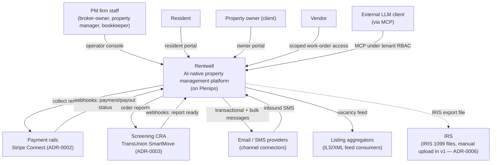

# C4 L1 — System context

```mermaid
graph TB
    staff["PM firm staff<br/>(broker-owner, property manager, bookkeeper)"]
    resident["Resident"]
    owner["Property owner (client)"]
    vendor["Vendor"]
    llm["External LLM client<br/>(via MCP)"]

    rentwell["Rentwell<br/>AI-native property management platform<br/>(on Plenipo)"]

    stripe["Payment rails<br/>Stripe Connect (ADR-0002)"]
    cra["Screening CRA<br/>TransUnion SmartMove (ADR-0003)"]
    channels["Email / SMS providers<br/>(channel connectors)"]
    ils["Listing aggregators<br/>(ILS/XML feed consumers)"]
    irs["IRS<br/>(IRIS 1099 files, manual upload in v1 — ADR-0006)"]

    staff -->|operator console| rentwell
    resident -->|resident portal| rentwell
    owner -->|owner portal| rentwell
    vendor -->|scoped work-order access| rentwell
    llm -->|MCP under tenant RBAC| rentwell

    rentwell -->|collect rent, payouts| stripe
    stripe -->|webhooks: payment/payout status| rentwell
    rentwell -->|order reports| cra
    cra -->|webhooks: report ready| rentwell
    rentwell -->|transactional + bulk messages| channels
    channels -->|inbound SMS| rentwell
    rentwell -->|vacancy feed| ils
    rentwell -.->|IRIS export file| irs
```
