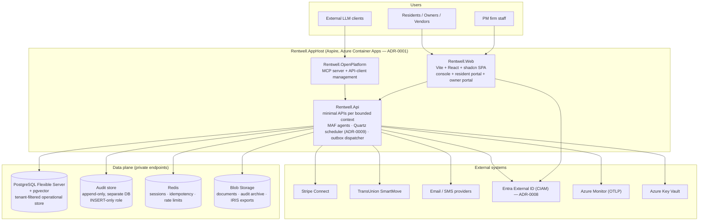

# C4 L2 — Containers (Aspire resources)

```mermaid
graph TB
    subgraph users["Users"]
        staff["PM firm staff"]
        portalUsers["Residents / Owners / Vendors"]
        llm["External LLM clients"]
    end

    subgraph aspire["Rentwell.AppHost (Aspire, Azure Container Apps — ADR-0001)"]
        web["Rentwell.Web<br/>Vite + React + shadcn SPA<br/>console + resident portal + owner portal"]
        api["Rentwell.Api<br/>minimal APIs per bounded context<br/>MAF agents · Quartz scheduler (ADR-0009) · outbox dispatcher"]
        openplatform["Rentwell.OpenPlatform<br/>MCP server + API-client management"]
    end

    subgraph data["Data plane (private endpoints)"]
        pg[("PostgreSQL Flexible Server<br/>+ pgvector<br/>tenant-filtered operational store")]
        audit[("Audit store<br/>append-only, separate DB<br/>INSERT-only role")]
        redis[("Redis<br/>sessions · idempotency · rate limits")]
        blob[("Blob Storage<br/>documents · audit archive · IRIS exports")]
    end

    subgraph external["External systems"]
        stripe["Stripe Connect"]
        cra["TransUnion SmartMove"]
        channels["Email / SMS providers"]
        entra["Entra External ID (CIAM) — ADR-0008"]
        monitor["Azure Monitor (OTLP)"]
        kv["Azure Key Vault"]
    end

    staff --> web
    portalUsers --> web
    web --> api
    llm --> openplatform
    openplatform --> api

    api --> pg
    api --> audit
    api --> redis
    api --> blob
    api --> stripe
    api --> cra
    api --> channels
    web --> entra
    api --> entra
    api --> monitor
    api --> kv
```
