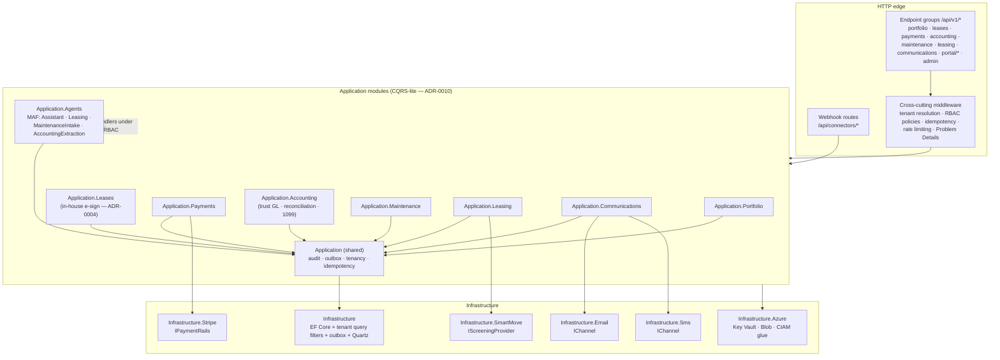

# C4 L3 — Components inside Rentwell.Api

```mermaid
graph TB
    subgraph edge["HTTP edge"]
        ep["Endpoint groups /api/v1/*<br/>portfolio · leases · payments · accounting ·<br/>maintenance · leasing · communications · portal/* · admin"]
        hooks["Webhook routes<br/>/api/connectors/*"]
        mw["Cross-cutting middleware<br/>tenant resolution · RBAC policies · idempotency ·<br/>rate limiting · Problem Details"]
    end

    subgraph app["Application modules (CQRS-lite — ADR-0010)"]
        portfolio["Application.Portfolio"]
        leases["Application.Leases<br/>(in-house e-sign — ADR-0004)"]
        payments["Application.Payments"]
        accounting["Application.Accounting<br/>(trust GL · reconciliation · 1099)"]
        maintenance["Application.Maintenance"]
        leasing["Application.Leasing"]
        comms["Application.Communications"]
        agents["Application.Agents<br/>MAF: Assistant · Leasing ·<br/>MaintenanceIntake · AccountingExtraction"]
        shared["Application (shared)<br/>audit · outbox · tenancy · idempotency"]
    end

    subgraph infra["Infrastructure"]
        ef["Infrastructure<br/>EF Core + tenant query filters + outbox + Quartz"]
        azure["Infrastructure.Azure<br/>Key Vault · Blob · CIAM glue"]
        stripeAd["Infrastructure.Stripe<br/>IPaymentRails"]
        craAd["Infrastructure.SmartMove<br/>IScreeningProvider"]
        emailAd["Infrastructure.Email<br/>IChannel"]
        smsAd["Infrastructure.Sms<br/>IChannel"]
    end

    ep --> mw --> app
    hooks --> app
    portfolio & leases & payments & accounting & maintenance & leasing & comms & agents --> shared
    shared --> ef
    payments --> stripeAd
    leasing --> craAd
    comms --> emailAd & smsAd
    app --> azure
    agents -->|tools call handlers under caller RBAC| app
```
